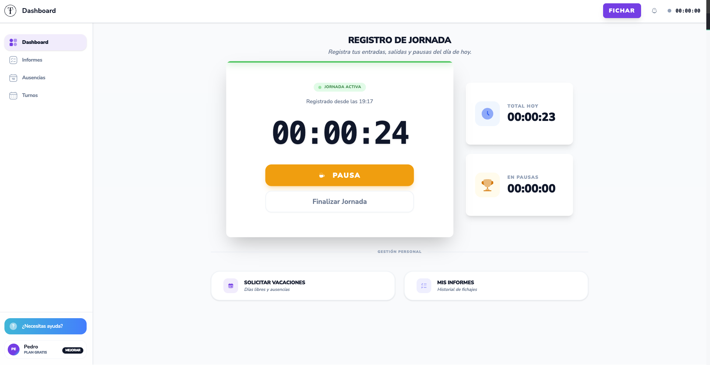
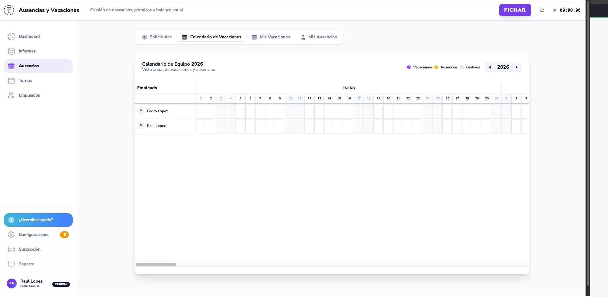
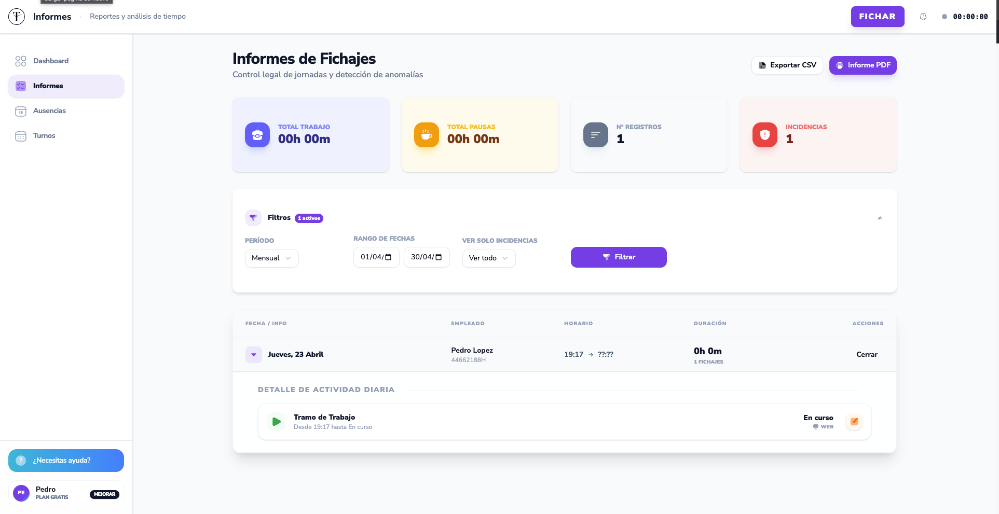
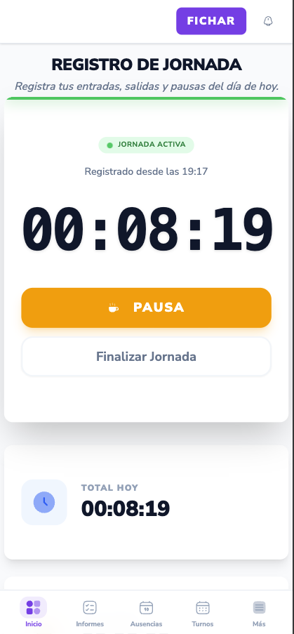

# TaviTime

<div align="center">


**Software de control horario para pymes españolas**

Cumple con el Real Decreto-ley 8/2019 de forma sencilla, legal y económica.

[🌐 Web](https://tavitime.es) · [📖 Documentación](#) · [🔧 Status](#)

</div>

---

## 🎯 El Problema

**Obligación legal**: Desde 2019, todas las empresas españolas están obligadas a registrar la jornada laboral de sus empleados.

**El dolor de las clínicas pequeñas**:
- ❌ Solutions enterprise costosas (>500€/mes)
- ❌ Software complejo que requiere equipo IT
- ❌ Plantillas Excel manuales e ilegales
- ❌ Sistemas de fichaje físicos (relojes) obsoletos

**TaviTime resuelve esto** con una solución web + móvil accesible desde 29€/mes.

---

## ✨ Características

### Para Empleados
- 📱 **Fichaje móvil** desde PWA (Progressive Web App)
- 📍 Geolocalización automática
- 🏖️ Solicitud de vacaciones y ausencias
- 📊 Historial de fichajes propio

### Para RRHH
- ✅ Aprobación de vacaciones y ausencias
- 👥 Gestión completa de empleados
- 📈 Reportes legales para inspecciones de trabajo
- 🔔 Alertas de fichajes anómalos

### para Administración
- ⚙️ Configuración de empresa (festivos, horarios)
- 👔 Gestión de roles y permisos
- 💳 Suscripción y facturación (Stripe)
- 🎛️ Panel de soporte

---

## 🛠️ Stack Tecnológico

### Backend
| Tecnología | Uso |
|------------|-----|
| **Laravel 12** | Framework PHP para API REST |
| **PostgreSQL** | Base de datos relacional |
| **Laravel Sanctum** | Autenticación SPA con cookies |
| **Spatie Permissions** | Roles y permisos multi-tenant |
| **Laravel Cashier** | Gestión de suscripciones Stripe |
| **DomPDF** | Generación de PDFs legales |

### Frontend
| Tecnología | Uso |
|------------|-----|
| **React 19** | UI con hooks modernos |
| **TypeScript 5.9** | Type safety estricto |
| **Vite 7** | Build tool ultra-rápido |
| **Tailwind CSS 4.x** | Estilos utility-first |
| **shadcn/ui** | Componentes accesibles |
| **React Query** | Caching y estado de servidor |

### Infraestructura
- **Hosting**: Vercel (frontends) + Servidor dedicado (API)
- **Base de datos**: PostgreSQL 14+
- **Pagos**: Stripe (webhooks + Cashier)
- **Email**: SMTP +队列 de processamiento

---

## 🏗️ Arquitectura

### Multi-tenant por `company_id`

```
┌─────────────────────────────────────────────────────────┐
│                    TaviTime System                      │
├─────────────────────────────────────────────────────────┤
│                                                         │
│  ┌──────────────┐  ┌──────────────┐  ┌──────────────┐ │
│  │   Frontend   │  │   Landing    │  │   Soporte    │ │
│  │  (React 19)  │  │   (Astro)    │  │  (React 19)  │ │
│  └──────┬───────┘  └──────┬───────┘  └──────┬───────┘ │
│         │                 │                 │          │
│         └─────────────────┼─────────────────┘          │
│                           │                            │
│                  ┌────────▼────────┐                   │
│                  │   Laravel API   │                   │
│                  │   (Sanctum)     │                   │
│                  └────────┬────────┘                   │
│                           │                            │
│         ┌─────────────────┼─────────────────┐          │
│         │                 │                 │          │
│  ┌──────▼──────┐  ┌──────▼──────┐  ┌──────▼──────┐   │
│  │ PostgreSQL  │  │   Stripe    │  │    SMTP     │   │
│  │ (company_id)│  │ (Webhooks)  │  │  (Mails)    │   │
│  └─────────────┘  └─────────────┘  └─────────────┘   │
└─────────────────────────────────────────────────────────┘
```

### Separación de Responsabilidades

- **FrontendTaviTime**: App principal para empleados y RRHH
- **LandingTaviTime**: Página de marketing (SEO, PX)
- **SoporteTaviTime**: Panel de soporte para gestionar tickets
- **ApiTaviTime**: API REST centralizada (Laravel)

---

## 📸 Screenshots

<!-- TODO: Añadir screenshots reales -->

### Dashboard (Empleado)

*Vista principal con widget de fichaje rápido*

### Gestión de Vacaciones

*Calendario de vacaciones y solicitud de días*

### Reportes (RRHH)

*Informe mensual para inspección de trabajo*

### Modo Móvil

*PWA instalable en iOS y Android*

---

## 📐 Arquitectura Técnica

### Autenticación: Sanctum Cookies
- Cookies HTTP-only (protección XSS)
- CSRF automático
- Revocación de sesiones desde backend
- Sin refresh tokens en cliente

### Permisos: Spatie Teams
- Roles por empresa (`company_id` como `team_id`)
- Permisos granulares sin tocar código
- Multi-tenant aislado completamente

### Suscripciones: Stripe + Cashier
- Webhooks para eventos de Stripe
- Middleware de validación de estado
- Límites de empleados por plan

### Estado Frontend: React Query
- Caching inteligente de API
- Optimistic updates
- Background refetch
- Sin Redux (menos boilerplate)

---

## 🎓 Decisiones de Diseño

### ¿Por qué PostgreSQL vs MySQL?
- Mejor soporte para JSON y consultas complejas
- Fiabilidad a largo plazo para reportes
- Type system más robusto

### ¿Por qué Sanctum vs JWT?
- Más seguro (cookies HTTP-only)
- Revocación de sesiones centralizada
- Menos código en cliente (no gestionamos expiración)

### ¿Por qué React Query vs Redux?
- Diseñado específicamente para server state
- Caching y revalidación automática
- Menos boilerplate que Redux + RTK Query

### ¿Por qué shadcn/ui vs Material-UI?
- Componentes copiados al proyecto (full control)
- Tailwind nativo (fácil customizar)
- Sin dependencia pesada de componentes

---

## 📊 Métricas

- ⏱️ **Time-to-market**: 12 semanas desde idea a MVP
- 📱 **PWA Score**: 95+/100 en Lighthouse
- 🔒 **Seguridad**: Auditoría de seguridad completada
- 📈 **Uptime**: 99.9% SLA

---

## 🤝 Contribuir

Este es un proyecto comercial de código cerrado. Si estás interesado en colaborar, contacta a [hola@tavitime.es](mailto:hola@tavitime.es).

---

## 📄 Licencia

Propiedad privada. Todos los derechos reservados © 2026 TaviTime.

---

<div align="center">

**Hecho con ❤️ para las pymes españolas**

[Web](https://tavitime.es) · [LinkedIn](https://linkedin.com/company/tavitime) · [Twitter](https://twitter.com/tavitime)

</div>
